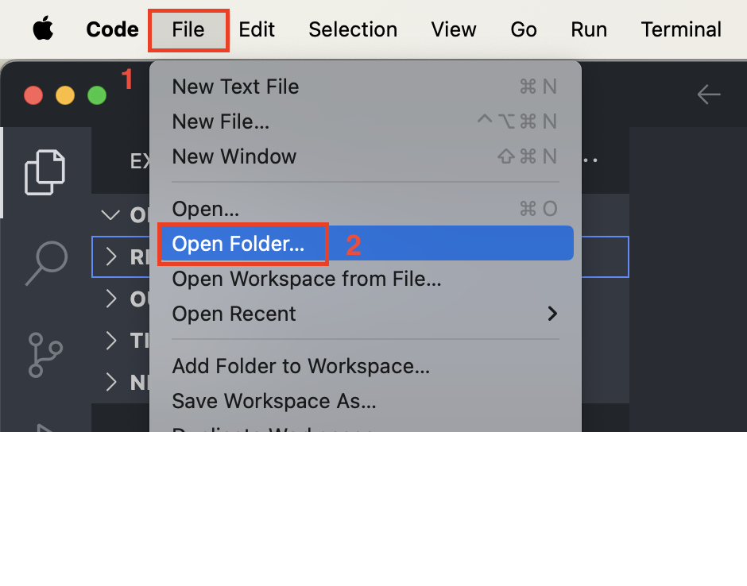

About me ◽️ 👨🏻‍💻 Front-End Engineer 

# Todo List App

This repository contains the source code for Todo List App 

# How to use code examples from Github

## Download the code source

###  Download code source for final application

1. Open repository main [page](https://github.com/king0-king0/react-todo-list).

2. Click on the green "Code" button to open a list and then click on the "Download ZIP" button to download a source code.

## Open project in the VS code (code editor)

Open the archive on your computer, open VS code (code editor) and cick "File" -> "Open Folder" -> Choose project folder => "Open".

## Start application

### 1. Install dependencies

Run the `npm install` command to install all the libraries needed to run the application.

### 2. Run application

Run the `npm run dev` command in terminal to start the application.
Open [http://localhost:5173](http://localhost:5173) to view it in your browser.
The page will reload when you make changes.
